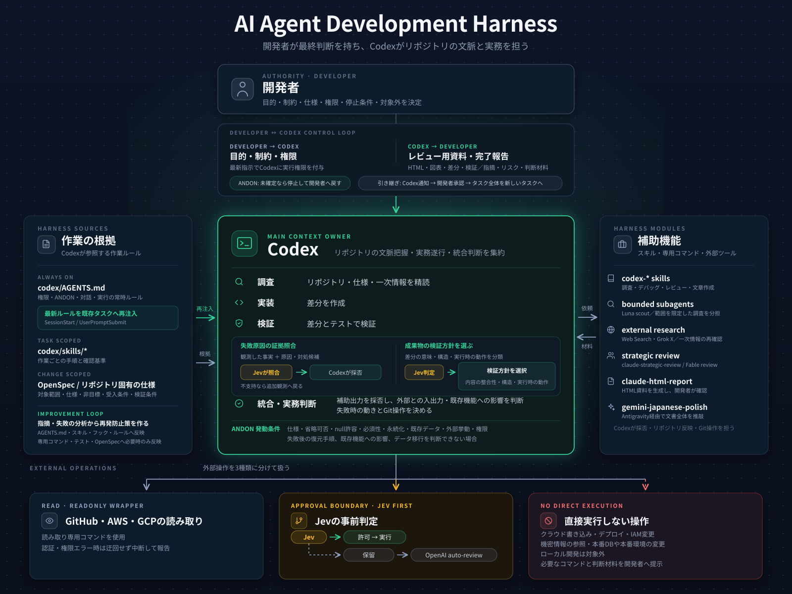

# AI Dev Harness

AI agent を実務開発の生産工程に組み込むための開発ハーネスです。

このリポジトリでは、AI agent に期待する振る舞いを、skill、hook、wrapper、review loop、test、OpenSpec などの実行系へ落とし込みます。目的は、AI に作業を丸投げすることではありません。人間が仕様、文脈、権限、検証、停止条件を定義し、agent が期待から外れたまま作業を進めにくい状態を作ることです。

各プロジェクトで得た失敗や改善は、顧客名、リポジトリ名、issue/PR 番号、固有パスを外し、再利用できる形に抽象化して残します。

## Concept

AI agent は、既存コード、会話履歴、指示文、利用可能な tool、実行権限、テスト結果を入力として動きます。したがって、期待する出力を得るには、プロンプトだけでなく、agent が読む文脈、使える tool、通るべき review、止まるべき条件まで設計する必要があります。

このリポジトリの考え方は次のとおりです。

- skill は、作業ごとの手順と判断基準を渡す
- thread handoff は、長期化した会話を全履歴のforkではなくcompactなcontinuation packetでfresh taskへ移す
- hook は、secret 表示、破壊的操作、raw CLI 実行などの逸脱を検知する
- wrapper は、Git、GitHub、cloud CLI などの危険な入口を狭める
- review loop は、実装結果を仕様、差分、テスト、残リスクに照らして見直す
- review visualization は、関係、順序、状態、比較、階層を人間が確認しやすい表現へ変換する
- test は、hook や wrapper の安全境界を継続的に確認する
- OpenSpec は、大きめの変更で仕様、設計判断、実装タスク、検証条件を分ける

## Architecture

| 役割 | 位置づけ | 主な責務 |
| --- | --- | --- |
| Human | 文脈と判断の入力 | 目的、制約、事業文脈、仕様判断、停止判断、やらないことを決める |
| Main agent | 実務担当の engineer | repo 読解、実装、差分確認、テスト確認、PR 説明作成、最終判断 |
| Skills | 作業手順書 | context engineering、debug loop、review、writing、decision doc、CDK design review など |
| Router | 薄い workflow 選択 | 実装、debug、review、writing、OpenSpec、advisor 相談の最小経路を選ぶ |
| Subagents | bounded scout | 影響範囲調査、既存パターン調査、差分レビュー。最終判断や Git 操作はしない |
| Strategic advisors | sidecar reviewer | 設計方針、長期保守性、代替案、大局的レビューを返す。採否は main agent が判断する |
| External research scouts | bounded evidence discovery | X など特定情報源の最新情報とURLを集める。事実確認と採否は main agent が行う |
| Execution harness | 実行境界 | Git、cloud、GitHub CLI、secret、production 操作を wrapper/rules/hooks で制御する |

## Review Visualization

文章だけでは、依存関係、状態遷移、処理順序、比較軸、階層を読み手が頭の中で組み立て直さなければならない場合があります。このハーネスでは、レビュー対象に合わせて表、Mermaid、timeline、tree などを併用します。複数の図表を一つの画面で確認したい場合や、情報量と配置がレビュー精度に影響する場合は、standalone HTML を使います。

Markdown、OpenSpec、code、schema など、判断や契約を記録した元の artifact を正とします。生成 HTML はレビュー用の一時 artifact として扱い、指摘は agent との会話へ戻します。採用した変更を元の artifact へ反映してから、必要に応じて HTML を再生成します。

詳しい選択基準と生成物の扱いは、[`review-visualization.md`](codex/skills/codex-frontend-ui/references/review-visualization.md) にまとめています。

## Repository Layout

- `codex/`: Codex 向けの設定例、skills、AGENTS.md 断片
- `hooks/`: Codex の誤操作を検知する local safety policy
- `wrappers/`: Git、GitHub、AWS、Google Cloud などの narrow entrypoint
- `tests/`: hook と wrapper の回帰テスト
- `docs/`: 構成思想、失敗パターン、運用上の考え方
- `assets/`: README や記事で使う図

## What This Repository Does Not Store

- 顧客名、プロジェクト名、issue/PR 番号、社内チャンネル名
- token、credential、secret、private key、`.env`
- 障害ログ、会話ログ、production データの生情報
- 特定リポジトリの path、branch 名、一時的な識別子に依存するルール
- その場限りの workaround

## Operating Principle

AI agent の失敗は、作業ログとして保存するのではなく、再発を防ぐ実行系へ戻します。

- 仕様を勝手に補完した場合は、contract safety や review skill に戻す
- 不要な fallback や後方互換を足した場合は、停止条件に戻す
- Git や cloud 操作で迷った場合は、wrapper、hook、rules に戻す
- 読みにくい文章を書いた場合は、writing skill の reference に戻す
- 共有環境で壊れやすい変更は、専用 design review skill に戻す

AI agent の利用を個人のプロンプト技術に閉じず、期待する振る舞いを保守できる開発資産として扱います。
